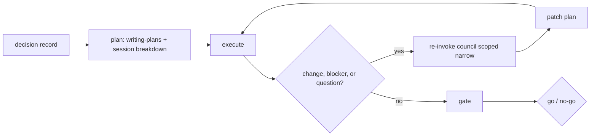

# cadence

cadence is the lifecycle skill that carries a council decision through to a planned, executed, security-gated outcome while keeping your context window economical. It is orchestration, not reimplementation - it drives existing superpowers skills through plan, execute, re-invoke, and gate rather than rebuilding what they already do.

## How It Works



Execution runs as a split-point safe-break loop: at each planned split point cadence can stop cleanly, hand off, and resume in a fresh session without losing the thread. See Context Economy below.

## Lifecycle Walkthrough

Plan - cadence reads the decision record (ideally a council decision record) and turns it into a master plan using writing-plans, then asks council's executor to produce a session breakdown sized so each unit of work fits a single economical context window.

Execute - cadence works the plan with checkpoints, invoking executing-plans and the test-first and verification skills as the work demands. At split points it takes safe breaks: a clean handoff so the next session resumes without re-reading the world.

Reinvoke - when a change, blocker, or open question surfaces mid-execution, cadence re-invokes council scoped narrow to the single question at hand, applies the answer, patches the plan, and returns to execution rather than re-running the whole decision.

Gate - before the work is called done, cadence runs the pre-merge security checklist, detects and invokes whatever security tools are present, and emits a go / no-go verdict with a hard floor that cannot be voted past.

## Commands

- `/cadence plan` - turn a decision record into a master plan plus a session breakdown.
- `/cadence execute` - work the plan with checkpoints and safe breaks.
- `/cadence gate` - run the pre-merge security checklist and emit a go / no-go verdict.
- `/cadence` - with no subcommand, infer the right phase from where the work currently is.

## Role-to-superpowers

| Need during execution | Skill invoked | Owning council role |
|---|---|---|
| Turn spec into plan | writing-plans | executor |
| Execute plan with checkpoints | executing-plans | executor |
| In-session independent tasks | subagent-driven-development | executor |
| Write code test-first | test-driven-development | empiricist |
| Confirm work actually works | verification-before-completion | empiricist |
| A bug or unexpected behavior | systematic-debugging | contrarian + relevant specialist |
| Pre-merge review | requesting-code-review / receiving-code-review | contrarian + security-redteam |
| Wrap up the branch | finishing-a-development-branch | executor |

## Context Economy

Session breakdown - at plan time, council's executor produces a session breakdown that splits the master plan into units each sized to fit a single economical context window. This is what makes long work shippable without context exhaustion.

Safe-break protocol - at each split point cadence runs a four-step break: handoff (write down where the work stands), safe-to-close (confirm the session can end without loss), kickoff (a ready-to-paste prompt that resumes the next session cheaply), and economics (keep the resumed session lean rather than re-reading everything).

Statusline - an optional live signal shows the current context usage so cadence and the operator can see when a break is due. It surfaces the running percentage and warns at the 80 percent default threshold. Without it, the skill cannot self-measure its own context usage; the threshold is then a judgment call rather than a measured one. See `adapters/claude-code/statusline/README.md`.

## Security Gate

Checklist summary - the gate has a hard FLOOR and a set of graded items. Floor items must all pass: no secrets in git, real authentication, row-level access control, no PII leaked, and the preset floor met. Graded items inform the verdict but do not by themselves block: dependency health and SAST findings.

Detect and invoke - cadence detects and runs whatever security tooling is present, including gitleaks, trivy, Dependabot, Semgrep, and CodeQL.

Verdict - the gate emits a single go / no-go. A failed floor item is a hard-floor veto: it forces no-go regardless of how the graded items look.

cadence does no auto-remediation; it reports findings for a human to fix. A missing tool is treated as reduced assurance, never as an automatic pass.

## Structure

```
cadence/
  SKILL.md
  core/
    flow/
    gate/
    mappings/
    prompts/
    schema/
  adapters/
    claude-code/
      statusline/
  README.md
  LICENSE
```

`SKILL.md` is the Claude entry point and reads its procedures from `core/`.

## Install

```bash
git clone https://github.com/vsruthi00/cadence.git
cd cadence
ln -s "$(pwd)" ~/.claude/skills/cadence
```

Confirm Claude Code lists `cadence` among its skills. Install council and ledger alongside cadence, since cadence orchestrates council and carries forward what ledger records. For the optional live context signal, see `adapters/claude-code/statusline/README.md`.

## Adapters and Other Agents

cadence keeps a clean seam: the procedures live in `core/` and each platform gets its own entry under `adapters/<platform>/`. Claude Code is available now. Cursor, Codex, and Gemini are planned. A new platform is added by writing a platform entry that runs the `core/flow/*.md` procedures, with no change to `core/`.

## License

cadence is released under the PolyForm Perimeter License 1.0.0. It is source-available, not OSI open source. You may use cadence for any purpose, including commercial work, but you may not repackage and sell it as a competing product.

Required Notice: Copyright 2026 Sruthi Valluru (https://github.com/vsruthi00)

See [LICENSE](LICENSE).

## Out of Scope (v1)

- Cursor, Codex, and Gemini adapters.
- Bundling or installing security tools.
- Automated remediation of gate findings.
- More than one escalation round on re-invocation.
- Hook-based context monitoring; hooks expose no token counters.
- Automatic session restart or compaction.
